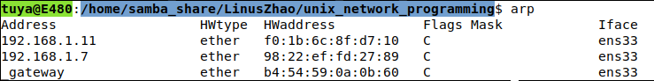
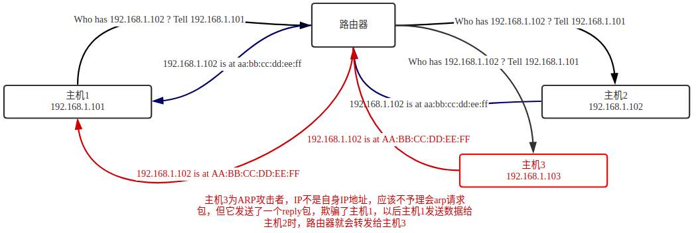
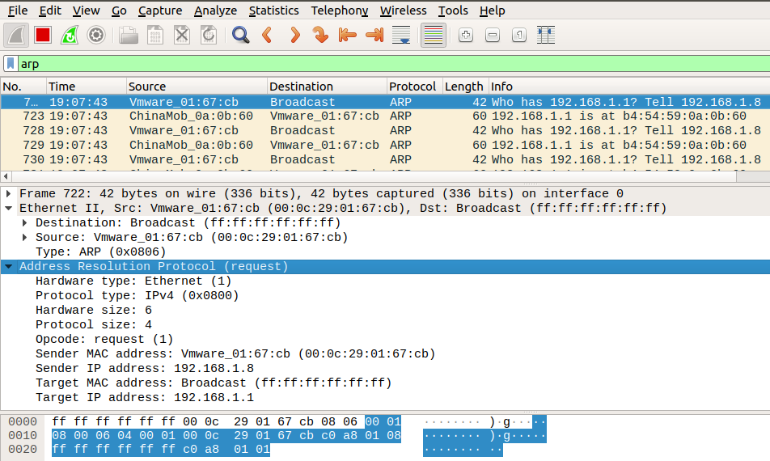

# arp

## 说明
    局域网上的计算机使用网际层的地址解析协议(ARP)把IP地址映射为物理地址。主机必须知道目的地网络适配器的物理地址才能
向它发送数据，ARP是一个重要的协议，但ARP包是明文的，过程是对用户完全可见的。

    对于用户来说，网络适配器就是IP地址标识的，然而在幕后，IP地址必须映射到物理地址，消息才能到达目的地。网段上每台主
机在内存中都保存着一个ARP缓存表，其中包含着网段上其他主机的IP地址与物理地址的对应关系。当主机需要向网段上的其他主机发送数据时，它会查看ARP缓存来获得目的地的物理地址。ARP缓存是动态变化的，如果要接收数据的主机mac地址当前并不存在于ARP缓存，主机就会发送一个名为ARP请求帧的广播。

    ARP请求帧包含未解析的IP地址，还包含发送这个请求主机的IP地址和物理地址。网段上的其他主机接收到这个ARP请求，拥有
这个未解析IP地址的主机会向发出请求的主机发送自己的物理地址。这个新的IP地址与物理地址的对应关系就会添加到请求主机的ARP缓存里。

    一般来说，ARP缓存里的条目在一定时间之后会过期，条目就会被从表里删除。当主机需要向这个条目所包含的IP地址发送数据
时，解析过程会再次重复。

## arp缓存表

## 图解arp中间人攻击

## arp报文结构

## 实现参考

[arp](https://github.com/LinusZhao/unix_network_programming/tree/master/examples/arp)