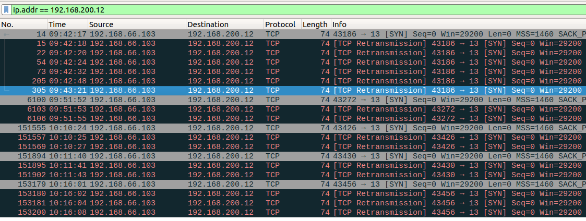

# 学习笔录

把网络编程当成读写一个文件来看

## 网络端口

- 端口管理机构：[iana.org](https://www.iana.org/assignments/service-names-port-numbers/)

- 49152到65535号端口, 根据定义，该段端口属于“动态端口”范围，没有端口可以被正式地注册占用

- 维基百科：https://zh.wikipedia.org/wiki/TCP/UDP%E7%AB%AF%E5%8F%A3%E5%88%97%E8%A1%A8
- /etc/services文件也是端口记录

| 端口 | 描述 | 状态 |
| ---- | ---| --- |
| 13 | daytime协议，给请求主机发送日期和时间 | 官方 |

## connect

The connect function is used by a TCP client to establish a connection with a TCP
server.

```c
#include <sys/socket.h>
int connect(int sockfd, const struct sockaddr *servaddr, socklen_t addrlen);
// Returns: 0 if OK, -1 on error
```

1. 默认为阻塞型接口,连接未成功时,线程进入睡眠状态;
2. 测试时请把ubuntu虚拟机设置成桥接模式,以模拟真实网络环境

### 重试次数和超时

重试次数和接口超时时间的关系：

测试环境：Linux E480 4.18.0-21-generic #22~18.04.1-Ubuntu SMP Thu May 16 15:07:19 UTC 2019 x86_64 x86_64 x86_64 GNU/Linu

net.ipv4.tcp_syn_retries 为linux系统网络配置参数，连接服务器时，syn包的重发次数

```shell
$ sudo sysctl -w net.ipv4.tcp_syn_retries=2  # 修改
$ sysctl net.ipv4.tcp_syn_retries	# 查看
net.ipv4.tcp_syn_retries = 2
```

测试结果：

| net.ipv4.tcp_syn_retries | 超时时间ms |
| :----------------------- | ---------- |
| 6                        | 131142     |
| 2                        | 7082       |
| 3                        | 15274      |

如下图，wireshark抓包结果，内核自动重试时间呈指数型增长；

最后一次的重试次数设置为3:

第一次发syn包后，超时1s未响应，重发第1包；No.153179

第1包超时2s未响应，重发第2包；No.153180

第2包超时4s未响应，重发第3包；No.153181

第3包超时8s未响应，connect接口返回失败；No.153200



#### 设置SO_SNDTIMEO

支持通过setsockopt接口设置套接字选项SO_SNDTIMEO，设置发送超时；

此时系统的net.ipv4.tcp_syn_retries参数无效，重试时间还是按指数增长；比如设置超时30s，重试次数就是4

### 错误返回

#### Connection timed out

1. 去连接一个本地子网中不存在的ip地址，发出ARP请求时，收不到响应

#### Operation now in progress

1. SO_SNDTIMEO设置的超时时间小于系统net.ipv4.tcp_syn_retries的重试参数的超时

#### connect error: Connection refused

	1. 服务器没有对应的端口服务请求，服务器立即响应一个rst分节

### 注意事项

1. 若connect失败则该sock不可再用，必须关闭，不能对这样的sock再次调用connect
2. 

## 疑问解答

1. connect接口超时时间怎么控制 ？
    https://www.cnblogs.com/minglee/p/10161899.html

2. 网络字节序 & 主机字节序


## 参考博客

1. https://www.cnblogs.com/lshs/p/6038477.html
